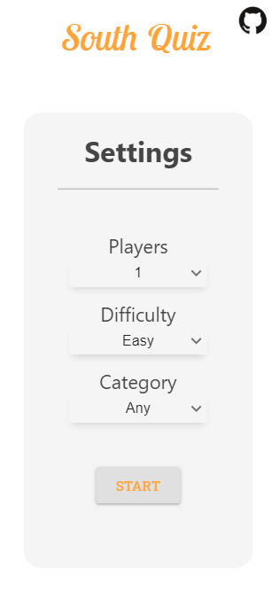
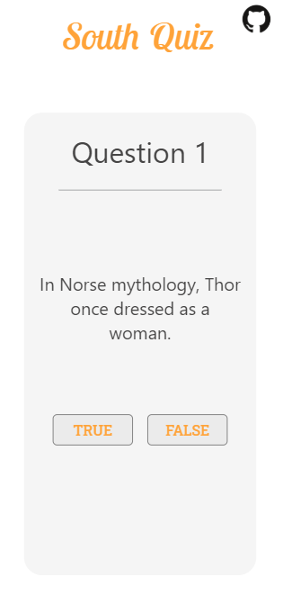

# South Quiz
A Quiz mini game built in <a href="https://github.com/facebook/react">React <a> that consumes the *https://opentdb.com/* Rest API. The game contains the follow features:

`-Single and Duo player mode`

`-Selectable difficulty`

`-4 Question categories to choose from`

`-Mobile first design`

`-Totally responsive`

## Motivation
After 3 months of self taught learning, i wanted to try if i could develop my first project and learn from it along the process. 
2 Weeks later here is the result!

## Appearance

 
 
 
 
 

 

## Demo
*https://south-quiz.netlify.app/*

## Available Scripts

In the project directory, you can run:

### `yarn start`

Runs the app in the development mode. 
Open [http://localhost:3000](http://localhost:3000) to view it in the browser.

The page will reload if you make edits. 
You will also see any lint errors in the console.

### `yarn test`

Launches the test runner in the interactive watch mode. 
See the section about [running tests](https://facebook.github.io/create-react-app/docs/running-tests) for more information.

### `yarn build`

Builds the app for production to the `build` folder. 
It correctly bundles React in production mode and optimizes the build for the best performance.

The build is minified and the filenames include the hashes. 
Your app is ready to be deployed!

See the section about [deployment](https://facebook.github.io/create-react-app/docs/deployment) for more information.

### `yarn eject`

If you aren’t satisfied with the build tool and configuration choices, you can `eject` at any time. This command will remove the single build dependency from your project.

Instead, it will copy all the configuration files and the transitive dependencies (webpack, Babel, ESLint, etc) right into your project so you have full control over them. All of the commands except `eject` will still work, but they will point to the copied scripts so you can tweak them. At this point you’re on your own.

